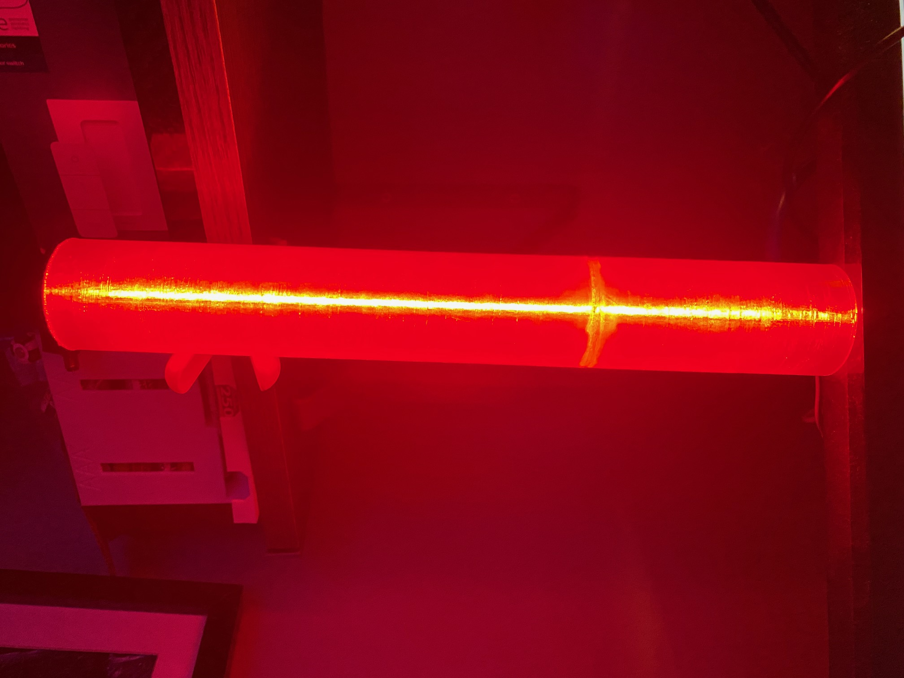

# RainbowShift-KlipperCode
RainbowShift Klipper Code for WLED Effects

Highly modified [Klipper NeoPixel Templates](https://github.com/digitalninja-ro/klipper-neopixel/blob/master/README.md) as this only works on Neopixles.
The idea is to port this to work (Partly) with WLED that are suppoerted in Moonraker.

Very early code of bed temp and progress display on [RainbowShift](https://vector3d.co.uk/product/rainbowshift-kit/) by Vector3D 

#### Assumptions 

* You have the WLED section in "moonrafer.conf" and that they are called "DaybreakNeos"
  [Moonraker setup](https://moonraker.readthedocs.io/en/latest/configuration/#wled)

* You also have in your macros the [WLED Macros](https://moonraker.readthedocs.io/en/latest/configuration/#wled) 

* Also your using a [Daybreak Neo](https://vector3d.co.uk/product/voron-daylight-on-a-stick-v3d-daybreak-neo/) by Vector3D with 13 pixles on it
  and this all works by using the WLED Web address when you set them up.

* Currently Its also fixed colours Blue (cold) to Pink (Hot) / Blue (0%) to Pink (100%) complete 
